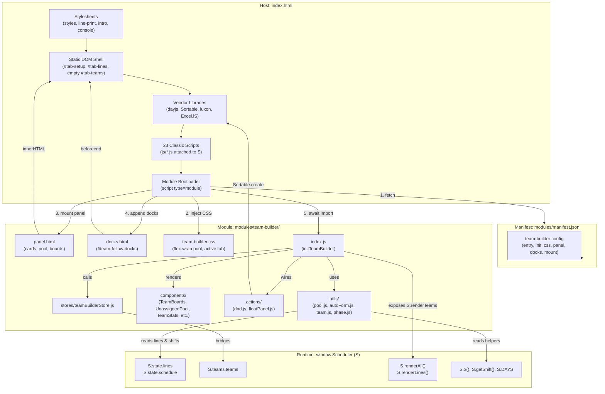

# BLADE Alpha — Architecture & Dependency Map

This document details the boot flow, component dependencies, DOM contracts, and module system lifecycle of the **BLADE Alpha** workforce allocation platform.

---

## 1. Boot Order

The application initializes in three distinct phases: host document parsing, classic runtime bootstrap, and dynamic module loading.

1. **`<!DOCTYPE html>` & Head Parsing**
   - Stylesheets load synchronously (blocking render):
     - `css/styles.css` (global layout, forms, tables, card theme)
     - `css/line-print.css` (bidding print-sheet media query rules)
     - `css/intro.css` (retro CRT console bezel & scanlines)
     - `css/console.css` (console masthead & terminal chrome)
2. **DOM Skeleton Rendering**
   - Introductory screen (`#blade-intro`)
   - Header masthead & action buttons (`.topbar`)
   - Tab navigation (`.tabs`: Setup, Coverage, Lines, Teams, Reports, Capacity)
   - Panel shells (`#tab-setup`, `#tab-coverage`, `#tab-lines`, `#tab-teams`, `#tab-capacity`, `#tab-reports`)
   - Modal templates (`#airport-config-modal`, `#shift-day-times-modal`, `#team-detail-modal`, `#instructions-modal`)
   - Console footer (`.console-footer`)
3. **Vendor Libraries (Synchronous `<script>` execution)**
   - `lib/dayjs.min.js` → `window.dayjs` (date manipulation helper)
   - `lib/Sortable.min.js` → `window.Sortable` (HTML5 drag-and-drop primitives)
   - `lib/luxon.min.js` → `window.luxon` (time-zone & duration math)
   - `lib/exceljs.min.js` → `window.ExcelJS` (bidding schedule `.xlsx` exporter)
4. **Classic JS Layer (Synchronous scripts registering on `window.Scheduler` as `S`)**
   - `js/constants.js` → `S.DAYS`, `S.BADGES`, `S.defaultShifts()`
   - `js/state.js` → `S.state` (lines, schedule, shifts, config), `S.shiftSeq`
   - `js/utils.js` → `S.$()`, `S.timeToMin()`, `S.minToTime()`, `S.safeNumber()`, `S.dj()`
   - `js/shifts.js` → `S.getShift()`, `S.readShiftsFromDom()`, `S.renderShiftsTable()`
   - `js/allocation.js` → `S.buildLines()`, `S.assignCertifications()`
   - `js/functions.js` → `S.ensureFunctionCoverage()`, `S.generateFunctionAssignments()`
   - `js/render.js` → `S.renderAll()`, `S.renderLines()`, `S.switchTab()`, `S.findLineById()`, `S.setLineTeam()`, `S.teamMetaForLine()`
   - `js/line-colors.js` → wraps `S.renderLines` & `S.renderAll` for RDO badge background colors
   - `js/reports.js` → renders staffing breakdown and gender parity analytics
   - `js/schedule.js` → `S.generate()`, `S.buildScheduleForLine()`
   - `js/io.js` → `S.exportJson()`, `S.applyPayload()`, `S.exportLinesExcel()`
   - `js/airport.js` → `S.getAirportConfig()`
   - `js/capacity.js` → `S.teamSexCounts()`, `S.teamWorksDay()`, `S.modSetForTeamDay()`
   - `js/modset-board.js` → mod-set board rendering
   - `js/export-board.js` → board view export
   - `js/instructions.js` → modal instructions logic
   - `js/main.js` → executes `S.init()`, binds tab switching, triggers initial `S.renderAll()`
   - `js/console-chrome.js` → wraps `S.renderAll` to refresh masthead counters
   - `js/airfield-boot.js` → airfield configuration bootstrap
   - `js/setup-ui.js` → `S.rebuildSetupTab()`, `S.snapshotFte()` — **deprecated: replaced by `modules/setup-panel/`**
   - `js/intro.js` → CRT intro terminal emulator, emits `blade-intro-done`
   - `js/coverage-cuts.js` → line coverage cut calculations
5. **Dynamic Module Bootloader (`<script type="module">` deferred execution)**
   - Fetches `modules/manifest.json`.
   - Polls until `window.Scheduler` is confirmed initialized.
   - For each configured manifest entry:
     - Injects referenced CSS stylesheets (e.g. `team-builder.css`) via `<link data-module-css="...">`.
     - Injects HTML fragments (e.g. `panel.html` into `#tab-teams`, `docks.html` into `<body>`).
     - Imports module entry point via absolute resolution: `import(new URL(cfg.entry, window.location.href).href)`.
     - Executes exported initializer (`initTeamBuilder(Scheduler)` or `init(Scheduler)`).

---

## 2. Boot Flow & Architecture

---

## 3. Component & File Dependency Matrix

### Host & Core Infrastructure

| File | Depends On | Provides | Notes |
|------|-----------|----------|-------|
| `index.html` | Vendor libs, `css/*.css`, `js/*.js`, `modules/manifest.json` | Core page scaffold, tab shells, module loader | `#tab-teams` is host-only placeholder |
| `scripts/copy-frontend.js` | Node `fs`, `path` | Builds `dist-frontend/` for Tauri desktop package | Copies `index.html`, `css/`, `js/`, `lib/`, `modules/` |
| `modules/manifest.json` | — | Declarative schema for pluggable UI modules | Configures `team-builder` assets and mount target |

### Classic Runtime (`window.Scheduler`)

| File | Depends On | Provides | Notes |
|------|-----------|----------|-------|
| `js/constants.js` | — | `S.DAYS`, `S.BADGES`, `S.defaultShifts()` | Core lookup dictionaries |
| `js/state.js` | — | `S.state`, `S.shiftSeq` | Central state tree (lines, schedule, shifts, config) |
| `js/utils.js` | `window.dayjs` | `S.$()`, `S.timeToMin()`, `S.minToTime()`, `S.dj()` | DOM and time calculation helpers |
| `js/shifts.js` | `S.state`, `S.$` | `S.getShift()`, `S.renderShiftsTable()` | Shift lookup and table rendering |
| `js/allocation.js` | `S.state` | `S.buildLines()`, `S.assignCertifications()` | Line generation engine |
| `js/functions.js` | `S.state` | `S.ensureFunctionCoverage()` | PAX/BAG/DFO duty assignment |
| `js/render.js` | `S.state`, `S.teams` | `S.renderAll()`, `S.renderLines()`, `S.switchTab()` | Global render coordination |
| `js/schedule.js` | `S.state`, DOM inputs | `S.generate()`, `S.buildScheduleForLine()` | Schedule engine |
| `js/capacity.js` | `S.teams`, `S.switchTab` | `S.teamSexCounts()`, `S.teamWorksDay()` | Daily checkpoint capacity calculations |
| `js/main.js` | All classic `js/*.js` | `S.init()`, tab click bindings | Final synchronous bootstrap step |

### Module: `team-builder`

| File | Depends On | Provides | Notes |
|------|-----------|----------|-------|
| `modules/team-builder/index.js` | `stores/*`, `components/*`, `actions/*`, `utils/*` | `initTeamBuilder()`, `renderAll()`, `autoFormTeams()` | Module orchestrator; binds events and bridges `S.teams` |
| `modules/team-builder/panel.html` | — | HTML fragment for `#tab-teams` | Toolbars, architecture inputs, pool, AM/PM boards |
| `modules/team-builder/docks.html` | — | HTML fragment for floating docks | `#team-follow-docks` (stats dock & boards dock) |
| `modules/team-builder/styles/team-builder.css` | — | Layout rules for team builder | Flex-wrap pool, board grids, active tab display |
| `modules/team-builder/stores/teamBuilderStore.js` | — | `teams`, `pool`, `filters`, `selected`, CRUD actions | Single source of truth for teams state; pure leaf node |
| `modules/team-builder/actions/dnd.js` | `window.Sortable`, `teamBuilderStore.js` | `initSortables()`, `syncTeamsFromDom()` | Drag-and-drop reordering between pool & team boards |
| `modules/team-builder/actions/floatPanel.js` | `teamBuilderStore.js`, `window.Scheduler` | `applyFollowMe()`, `initFloatPanels()`, `toggleTeamPin()` | Draggable floating dock coordination |
| `modules/team-builder/components/AutoFormControls.js` | `teamBuilderStore.js` | `injectAutoFormControls()` | Inputs for start-window and RDO matching tolerance |
| `modules/team-builder/components/FollowMeDock.js` | `teamBuilderStore.js`, `utils/pool.js`, `utils/team.js` | `renderPinnedSummaries()` | Floating dock team member list |
| `modules/team-builder/components/LineCard.js` | `teamBuilderStore.js`, `utils/team.js`, `S.getShift` | `lineCardHtml()` | Reusable staff line card with drag handles & badges |
| `modules/team-builder/components/OddityBanner.js` | `teamBuilderStore.js`, `utils/team.js`, `S.$` | `refreshTeamOddityBanner()` | Live counter of team staffing rule anomalies |
| `modules/team-builder/components/TeamBoard.js` | `utils/pool.js`, `utils/team.js`, `LineCard.js` | `teamBoardHtml()` | Individual AM/PM team card |
| `modules/team-builder/components/TeamBoards.js` | `teamBuilderStore.js`, `utils/phase.js`, `TeamBoard.js` | `renderTeamBoards()` | AM and PM container rendering |
| `modules/team-builder/components/TeamFilters.js` | `teamBuilderStore.js`, `S.DAYS` | `renderTeamFilters()` | Filter by role, start time, RDO, and batch assign |
| `modules/team-builder/components/TeamPills.js` | `teamBuilderStore.js`, `utils/team.js`, `utils/phase.js` | `renderTeamPills()`, `teamSummaryHtml()` | Team selector chips and summary pill badges |
| `modules/team-builder/components/TeamStats.js` | `teamBuilderStore.js`, `utils/pool.js`, `utils/team.js` | `renderTeamStats()` | Gender and role distribution statistics |
| `modules/team-builder/components/UnassignedPool.js` | `teamBuilderStore.js`, `utils/pool.js`, `LineCard.js` | `renderUnassignedPool()`, `selectAllVisible()` | Role-grouped or unassigned candidate pool |
| `modules/team-builder/utils/autoForm.js` | `teamBuilderStore.js`, `utils/pool.js`, `utils/team.js` | `autoFormTeams()` | Heuristic clustering algorithm for teams |
| `modules/team-builder/utils/phase.js` | `utils/pool.js`, `S.getShift`, `S.phaseOfStart` | `teamPhaseInfo()`, `isShiftAM()` | AM/PM phase classification |
| `modules/team-builder/utils/pool.js` | `teamBuilderStore.js`, `utils/team.js`, `S.state.lines` | `collectTeamPool()`, `unassignedPool()`, `memberLine()` | Line-to-pool resolution and assignment indexing |
| `modules/team-builder/utils/team.js` | `teamBuilderStore.js`, `utils/phase.js`, `S.DAYS` | `sexOf()`, `teamMemberCounts()`, `renumberTeamsByStart()` | Team metadata and gender counter helpers |
| `modules/team-builder/utils/time.js` | `S.getShift`, `S.timeToMin` | `startOf()`, `startMins()`, `startsClose()` | Time normalization and shift start comparisons |

---

## 4. DOM Contract

### Elements Supplied by `panel.html` (Mounted inside `#tab-teams`)

| Element ID | Consumer | Purpose |
|------------|----------|---------|
| `btn-team-new` | `index.js` | Button to create an unassigned team |
| `btn-team-build` | `index.js` | Button to toggle floating dock mode |
| `team-count-hint` | `index.js` | Status text showing total teams and pool counts |
| `team-architecture` | `AutoFormControls.js` | Container where auto-form settings are injected |
| `arch-stso` | `autoForm.js`, `OddityBanner.js` | STSO target count per team |
| `arch-ltso` | `autoForm.js`, `OddityBanner.js` | LTSO target count per team |
| `arch-tso` | `autoForm.js`, `OddityBanner.js` | TSO target count per team |
| `btn-team-auto-form` | `index.js` | Triggers auto-form algorithm |
| `arch-hint` | `AutoFormControls.js` | Descriptive summary of target team ratio |
| `team-filters` | `TeamFilters.js` | Container for role/shift/RDO filtering controls |
| `team-pool` | `UnassignedPool.js`, `TeamPills.js` | Unassigned staff line card container |
| `pool-group-by-role` | `UnassignedPool.js` | Checkbox toggle for role categorization |
| `team-boards-am` | `TeamBoards.js` | AM shift team cards container |
| `team-boards-pm` | `TeamBoards.js` | PM shift team cards container |

### Elements Supplied by `docks.html` (Injected into `<body>`)

| Element ID | Consumer | Purpose |
|------------|----------|---------|
| `team-follow-docks` | `floatPanel.js`, bootloader | Outer wrapper for floating panels |
| `team-stats-dock` | `floatPanel.js` | Floating assignment stats panel |
| `btn-build-close` | `index.js` | Button to exit floating dock mode |
| `team-stats-body` | `TeamStats.js` | Render target for live staffing distribution stats |
| `team-boards-dock` | `floatPanel.js`, `FollowMeDock.js` | Floating pinned teams dock |
| `btn-team-new-dock` | `index.js` | "+ New" team button located within the floating dock |
| `team-boards-follow` | `FollowMeDock.js` | Render target for pinned team summaries |

### Elements Provided by Host (`index.html`)

| Element ID | Consumer | Purpose |
|------------|----------|---------|
| `tab-teams` | Bootloader, `floatPanel.js` | Mounting target section for `panel.html` |
| `team-detail-modal` | `floatPanel.js` | Modal dialog for inspecting team members |

---

## 5. Architectural Health & Risk Mitigations

1. **Host/Module Decoupling**
   - The root `index.html` contains no inline Teams UI HTML, no static docks markup, and no inline Teams `<style>` blocks.
   - All Teams UI assets reside exclusively in `modules/team-builder/`.
2. **Distribution Packaging (`scripts/copy-frontend.js`)**
   - The frontend build script copies `modules/` directly into `dist-frontend/modules/`, ensuring desktop Tauri releases carry all dynamic assets.
3. **Circular Import Verification**
   - `stores/teamBuilderStore.js` is an independent leaf node with 0 internal imports.
   - The import graph across `utils/`, `components/`, and `actions/` forms a strict Directed Acyclic Graph (DAG).
4. **Defensive Scheduling Bridge**
   - Classic JS methods check `S.teams && S.teams.teams` defensively.
   - `initTeamBuilder(Scheduler)` immediately establishes `S.teams.teams = teams`, registers `S.renderTeams`, and registers `S.createTeam`.
